# HobbyTracker - Proje Dokümantasyonu

---

# 1. GİRİŞ

## 1.1 Projenin Amacı

HobbyTracker, kullanıcıların dijital medya tüketim alışkanlıklarını (Oyun, Kitap, Film, Dizi) kayıt altına almalarını, istatistiksel verilerle izlemelerini ve kişisel bir arşiv oluşturmalarını sağlayan bir Windows masaüstü uygulamasıdır.

Projenin temel amaçları:
- Kullanıcıların oynadıkları oyunları, okudukları kitapları, izledikleri film ve dizileri takip etmelerini sağlamak
- İlerleme durumlarını (sayfa, süre, bölüm) görsel olarak sunmak
- Kişisel istatistikler ve grafiklerle kullanım analizi sağlamak
- Bulut tabanlı veri senkronizasyonu ile çoklu cihaz desteği sunmak

## 1.2 Projenin Kapsamı

HobbyTracker uygulaması aşağıdaki modülleri kapsamaktadır:

| Modül | Açıklama |
|-------|----------|
| **Kitaplar** | Google Books API entegrasyonu, sayfa takibi, yıllık okuma hedefi |
| **Filmler** | TMDB API entegrasyonu, izleme süresi, oyuncu kadrosu |
| **Oyunlar** | RAWG API entegrasyonu, oynama süresi, platform bilgisi |
| **Diziler** | TMDB API entegrasyonu, sezon/bölüm bazlı takip |
| **Dashboard** | Genel istatistikler, aktivite grafikleri, son eklenenler |

### Kapsam Dışı
- Mobil uygulama geliştirme
- Sosyal medya entegrasyonu
- Çoklu kullanıcı (aile) hesapları

## 1.3 Tanımlamalar ve Kısaltmalar

| Terim | Açıklama |
|-------|----------|
| **WPF** | Windows Presentation Foundation - Microsoft'un masaüstü UI framework'ü |
| **MVVM** | Model-View-ViewModel - Yazılım mimari deseni |
| **API** | Application Programming Interface - Uygulama Programlama Arayüzü |
| **TMDB** | The Movie Database - Film ve dizi veritabanı servisi |
| **RAWG** | Video oyun veritabanı servisi |
| **Firebase** | Google'ın bulut tabanlı backend servisi |
| **CRUD** | Create, Read, Update, Delete - Temel veri işlemleri |
| **UI/UX** | User Interface / User Experience - Kullanıcı Arayüzü / Deneyimi |

---

<div style="page-break-after: always;"></div>

# 2. PROJE PLANI

## 2.1 Giriş

Bu bölüm, HobbyTracker projesinin planlama, yönetim ve uygulama süreçlerini detaylı olarak açıklamaktadır.

## 2.2 Projenin Plan Kapsamı

Proje, Çevik (Agile) metodoloji kullanılarak, artırımlı (incremental) ve yinelemeli (iterative) bir yaklaşımla geliştirilmiştir.

## 2.3 Proje Zaman-İş Planı

| Tarih Aralığı | Hafta | Aktivite |
|---------------|-------|----------|
| 12-15 Aralık 2025 | 1 | Proje altyapısı, Firebase kurulumu, temel model yapısı |
| 16-22 Aralık 2025 | 2 | Oyunlar modülü geliştirme, RAWG API entegrasyonu |
| 23-29 Aralık 2025 | 3 | Filmler ve Diziler modülü, TMDB entegrasyonu |
| 30 Aralık 2025 - 4 Ocak 2026 | 4 | Kitaplar modülü, Dashboard, test ve iyileştirmeler |

**Toplam Proje Süresi:** 24 gün (12 Aralık 2025 - 4 Ocak 2026)

## 2.4 Proje Ekip Yapısı

| Rol | Kişi | Sorumluluklar |
|-----|------|---------------|
| Proje Yöneticisi / Geliştirici | Salih Eren Çavuşoğlu| Tüm geliştirme, tasarım, test ve dokümantasyon |

## 2.5 Önerilen Sistemin Teknik Tanımları

- **Platform:** Windows 10/11 Masaüstü
- **Framework:** .NET 8.0 + WPF
- **Veritabanı:** Firebase Realtime Database
- **Kimlik Doğrulama:** Firebase Authentication
- **UI Kütüphanesi:** DevExpress WPF v25.1.7

## 2.6 Kullanılan Özel Geliştirme Araçları ve Ortamları

| Araç/Ortam | Sürüm | Amaç |
|------------|-------|------|
| Visual Studio 2022 | 17.x | IDE |
| .NET SDK | 8.0 | Geliştirme framework'ü |
| Git | - | Versiyon kontrolü |
| Firebase Console | - | Backend yönetimi |
| Postman | v10.x (Latest) | API test |

## 2.7 Proje Standartları, Yöntem ve Metodolojiler

### Metodoloji: Agile (Çevik)

**Parça Parça İlerleme (Incremental):**
1. Temel veritabanı ve model yapısı kuruldu
2. Oyunlar modülü tamamlandı
3. Filmler ve Diziler modülleri eklendi
4. Kitaplar modülü ve Dashboard eklendi

**Geri Bildirimle Değişim (Iterative):**
- İlk tasarımlar basit tutuldu, sonradan Dark/Neon dashboard tasarımına geçildi
- Firebase yapısında Array hatası tespit edildi, HashSet mantığıyla benzersiz Key'ler kullanılarak Dictionary yapısına geçildi

### Kodlama Standartları
- C# Naming Conventions
- XML Documentation Comments
- MVVM Pattern uyumu

## 2.8 Kalite Sağlama Planı

| Aktivite | Yöntem |
|----------|--------|
| Kod Kalitesi | Visual Studio Code Analysis, XML Documentation |
| UI/UX Kalitesi | Kullanıcı geri bildirimleri, iteratif tasarım |
| Fonksiyonel Test | Manuel test senaryoları |
| API Entegrasyon | Postman ile endpoint testleri |

## 2.9 Konfigürasyon Yönetim Planı

- **Versiyon Kontrolü:** Git
- **Branch Stratejisi:** main (stabil) / feature branches
- **Konfigürasyon Dosyaları:** `firebase_config.json`, `App.config`

## 2.10 Kaynak Yönetim Planı

| Kaynak Türü | Detay |
|-------------|-------|
| İnsan Kaynağı | 1 geliştirici, günde ortalama 4-6 saat |
| Donanım | Windows 11 geliştirme makinesi |
| Yazılım | Visual Studio 2022, DevExpress lisansı |
| Bulut Servisleri | Firebase (Ücretsiz tier) |

## 2.11 Eğitim Planı

### Hedef Kullanıcı Kitlesi
HobbyTracker uygulamasının hedef kitlesi; dijital medya tüketim alışkanlıklarını kayıt altına almak, istatistiksel verilerle izlemek ve kişisel bir arşiv oluşturmak isteyen bireysel kullanıcılardır.

Hedef kitle demografisi; temel bilgisayar okuryazarlığına sahip, 15-45 yaş aralığındaki öğrenciler, çalışanlar ve hobi tutkunlarını kapsamaktadır.

### Eğitim Modeli: Kendi Kendine Öğrenme (Self-Paced Learning)

| Materyal | Açıklama |
|----------|----------|
| **Kullanıcı El Kitabı (PDF)** | Tüm fonksiyonları adım adım açıklayan görsel destekli doküman |
| **Arayüz İçi İpuçları (Tooltips)** | Buton ve grafiklerde anlık açıklama metinleri |
| **İlk Kullanım Sihirbazı (Onboarding)** | 3 adımlık karşılama ekranı |

## 2.12 Test Planı

| Test Türü | Kapsam | Yöntem |
|-----------|--------|--------|
| Birim Testi | Model sınıfları, Servisler | Manuel doğrulama |
| Entegrasyon Testi | Firebase, API entegrasyonları | Senaryo bazlı test |
| Kullanıcı Arayüzü Testi | Tüm CRUD işlemleri | Manuel test |
| Performans Testi | Veri listeleme, resim yükleme | Gözlem bazlı |

## 2.13 Bakım Planı

Bakım planı detayları Bölüm 7'de açıklanmaktadır.

## 2.14 Projede Kullanılan Yazılım/Donanım Araçları

### Yazılım

| Paket | Sürüm | Amaç |
|-------|-------|------|
| CommunityToolkit.Mvvm | 8.4.0 | MVVM altyapısı |
| DevExpress.Wpf.* | 25.1.7 | UI bileşenleri ve grafikler |
| FirebaseAuthentication.net | 4.1.0 | Kimlik doğrulama |
| FirebaseDatabase.net | 5.0.0 | Realtime veritabanı |
| Newtonsoft.Json | 13.0.4 | JSON serileştirme |
| RestSharp | 112.1.0 | HTTP istekleri |

### Donanım Gereksinimleri

| Bileşen | Minimum |
|---------|---------|
| İşlemci | 1 GHz veya üzeri |
| RAM | 4 GB |
| Disk | 200 MB boş alan |
| Ekran | 1366x768 çözünürlük |
---

## 2.15 Maliyet Kestirimi (İşlev Nokta Analizi)

### İşlev Nokta Hesaplama Tablosu

| Ölçüm Parametresi | Sayı | Ağırlık Faktörü | Toplam Puan |
|-------------------|------|-----------------|-------------|
| Kullanıcı Girdi Sayısı | 16 | 4 | 64 |
| Kullanıcı Çıktı Sayısı | 12 | 5 | 60 |
| Kullanıcı Sorgu Sayısı | 8 | 4 | 32 |
| Veri Tabanındaki Düğüm Sayısı | 6 | 10 | 60 |
| Harici Arayüz Sayısı | 4 | 7 | 28 |
| **Ana İşlev Nokta Sayısı (AİN)** | | | **244** |

### Teknik Karmaşıklık Faktörleri

| Faktör | Değer (0-5) |
|--------|-------------|
| Veri iletişimi | 4 |
| Dağıtık veri işleme | 3 |
| Performans | 3 |
| Yoğun konfigürasyon | 2 |
| İşlem hızı | 3 |
| Çevrimiçi veri girişi | 5 |
| Son kullanıcı verimliliği | 4 |
| Çevrimiçi güncelleme | 5 |
| Karmaşık işleme | 2 |
| Yeniden kullanılabilirlik | 3 |
| Kurulum kolaylığı | 4 |
| Operasyonel kolaylık | 4 |
| Çoklu platform | 1 |
| Değişim kolaylığı | 3 |
| **Toplam TDI** | **46** |

### Hesaplama

```
Teknik Karmaşıklık Faktörü (TKF) = 0.65 + (0.01 × TDI)
TKF = 0.65 + (0.01 × 46) = 1.11

İşlev Noktası (İN) = AİN × TKF
İN = 244 × 1.11 = 270.84 ≈ 271

Tahmini Kod Satır Sayısı (C# için ~30 satır/İN)
KLOC = 271 × 30 = 8,130 satır
```

### Maliyet Özeti

| Metrik | Değer |
|--------|-------|
| İşlev Noktası | 271 |
| Tahmini Kod Satırı | ~8,130 |
| Geliştirme Süresi | 24 gün |
| Geliştirici Sayısı | 1 |
| Adam-Gün | 24 |

---

<div style="page-break-after: always;"></div>

# 3. SİSTEM ÇÖZÜMLEME

## 3.1 Mevcut Sistem İncelemesi

### 3.1.1 Örgüt Yapısı
Bu proje bireysel kullanıcılar için geliştirilmiş kişisel bir takip uygulamasıdır.

### 3.1.2 İşlevsel Model
Mevcut durumda kullanıcılar hobi aktivitelerini Excel, not defterleri veya çeşitli web siteleri ile takip etmektedir.

### 3.1.3 Veri Modeli
Mevcut sistemlerde veriler dağınık ve standartlaştırılmamış durumdadır.

### 3.1.4 Varolan Yazılım/Donanım Kaynakları
Windows bilgisayar, internet bağlantısı, web tarayıcı.

### 3.1.5 Varolan Sistemin Değerlendirilmesi
- Dağınık veri problemi
- Manuel güncelleme zorluğu
- İstatistik eksikliği

## 3.2 Gereksenen Sistemin Mantıksal Modeli

### 3.2.1 Giriş
Yeni sistem tüm hobi aktivitelerini tek bir merkezi uygulamada toplamayı hedefler.

### 3.2.2 İşlevsel Model
Modüler CRUD yapısı ile Kitaplar, Filmler, Oyunlar ve Diziler yönetimi.

### 3.2.3 Genel Bakış
Dashboard merkezli, kart tabanlı görüntüleme sistemi.

### 3.2.4 Bilgi Sistemleri/Nesneler
- Book, Movie, Game, Series, Episode, UserStats

### 3.2.5 Veri Modeli
HobbyItem temel sınıfından türetilen Book ve Game sınıfları; bağımsız Movie ve Series sınıfları.

### 3.2.6 Veri Sözlüğü
Id, Title, Status, Score, AddedDate, IsFavorite alanları tüm modellerde ortaktır.

### 3.2.7 İşlevlerin Sıradüzeni
1. Kullanıcı Yönetimi (Kayıt/Giriş/Çıkış)
2. İçerik Yönetimi (CRUD işlemleri)
3. İstatistik Görüntüleme

### 3.2.8 Başarım Gerekleri
Sayfa yükleme < 2sn, API yanıt < 3sn, anlık veri senkronizasyonu.

## 3.3 Arayüz Gerekleri

### 3.3.1 Yazılım Arayüzü
Firebase SDK, TMDB API, RAWG API, Google Books API.

### 3.3.2 Kullanıcı Arayüzü
Modern Dark Theme, sidebar navigasyonu, kart tabanlı içerik.

### 3.3.3 İletişim Arayüzü
HTTPS, JSON, RESTful API.

### 3.3.4 Yönetim Arayüzü
Firebase Console.

## 3.4 Belgeleme Gerekleri

### 3.4.1 Geliştirme Sürecinin Belgelenmesi
XML Documentation Comments, proje dokümantasyonu.

### 3.4.2 Eğitim Belgeleri
Kullanıcı El Kitabı, arayüz içi tooltip'ler.

### 3.4.3 Kullanıcı El Kitapları
Kurulum kılavuzu, özellik açıklamaları, SSS.

---

<div style="page-break-after: always;"></div>

# 4. SİSTEM TASARIMI

## 4.1 Genel Tasarım Bilgileri

### 4.1.1 Genel Sistem Tanımı
HobbyTracker, WPF tabanlı masaüstü uygulaması olup Firebase backend servisleri ile entegre çalışmaktadır.

### 4.1.2 Varsayımlar ve Kısıtlamalar
**Varsayımlar:**
- Kullanıcının aktif internet bağlantısı var
- Windows 10+ işletim sistemi kullanılıyor
- .NET 8.0 Runtime yüklü

**Kısıtlamalar:**
- Sadece Windows platformu destekleniyor
- Çevrimdışı çalışma modu yok
- Harici API'ler (TMDB, RAWG, Google Books) belirli istek sınırlarına (rate limit) sahiptir; sınır aşımında kullanıcı bilgilendirilir

**Güvenlik Notu:**
API anahtarları (API Keys) ve Firebase yapılandırma bilgileri, ideal olarak Environment Variables (Ortam Değişkenleri) veya güvenli bir konfigürasyon dosyasında saklanmalıdır.

### 4.1.3 Sistem Mimarisi
```
┌─────────────┐     ┌─────────────┐     ┌─────────────┐
│   Views     │────▶│  Services   │────▶│  Firebase   │
│   (XAML)    │     │   (C#)      │     │  (Cloud)    │
└─────────────┘     └─────────────┘     └─────────────┘
       │                   │
       ▼                   ▼
┌─────────────┐     ┌─────────────┐
│   Models    │     │ External    │
│   (C#)      │     │ APIs        │
└─────────────┘     └─────────────┘
```

### 4.1.3.1 Use Case Diyagramı

Sistemin kullanım senaryolarını gösteren Use Case diyagramı Şekil 18'de görselleştirilmiştir.


*Şekil 18: Use Case Diyagramı - Sistemin tüm kullanım senaryoları*

### 4.1.3.2 Sınıf Diyagramı (Class Diagram)

Sistemin sınıf yapısını ve ilişkilerini gösteren Class Diagram Şekil 19'da görselleştirilmiştir.


*Şekil 19: Sınıf Diyagramı - Model, servis sınıfları ve ilişkileri*

### 4.1.4 Dış Arabirimler

#### 4.1.4.1 Kullanıcı Arabirimleri
Uygulamanın ana kullanıcı arayüzü bileşenleri şunlardır:

- **MainWindow:** Ana uygulama penceresi, sidebar navigasyon (Şekil 3-6)
- **Dashboard:** Genel istatistikler ve özet bilgiler (Şekil 3-6)
- **ListView'ler:** Kitaplar (Şekil 13), Filmler (Şekil 10), Oyunlar (Şekil 7), Diziler (Şekil 16)
- **Modal Pencereler:** Ekleme (Şekil 8, 11, 14) ve düzenleme formları (Şekil 9, 12, 15, 17)

**Ekran Görüntüleri:**

#### Kimlik Doğrulama Ekranları

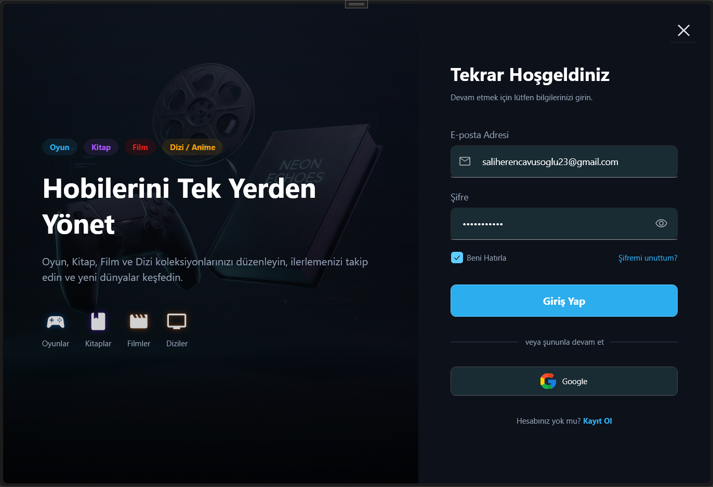
*Şekil 1: Giriş Ekranı*


*Şekil 2: Kayıt Ekranı*

#### Dashboard Ekranları

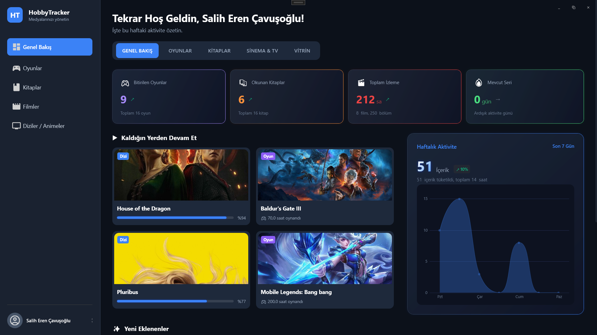
*Şekil 3: Dashboard - Genel Bakış*

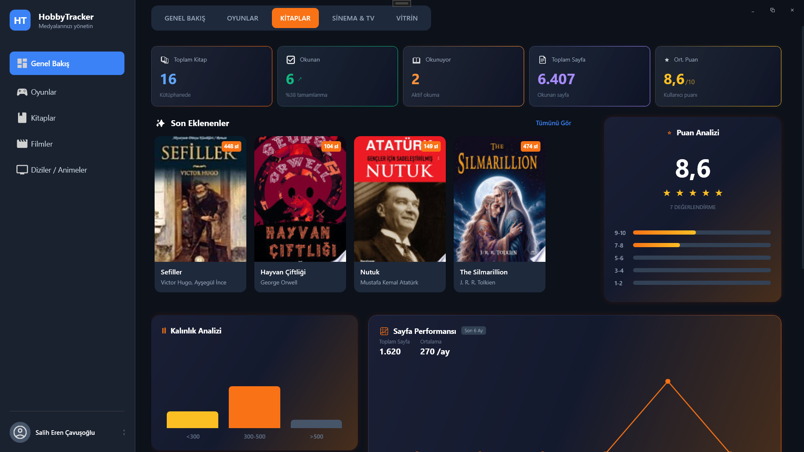
*Şekil 4: Dashboard - Kitaplar İstatistikleri*


*Şekil 5: Dashboard - Oyunlar İstatistikleri*

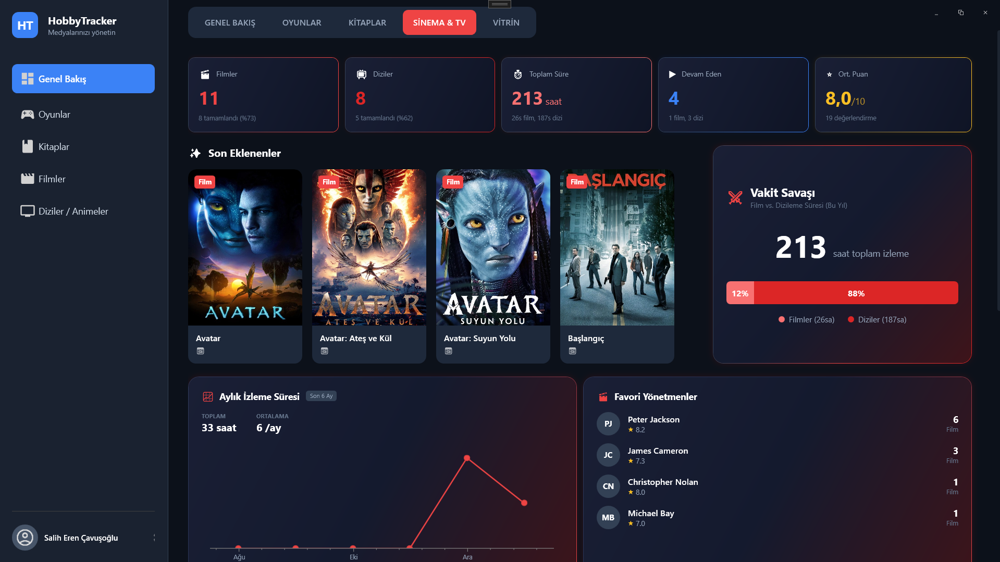
*Şekil 6: Dashboard - Sinema & TV İstatistikleri*

#### Oyunlar Modülü


*Şekil 7: Oyunlar Ana Sayfa*

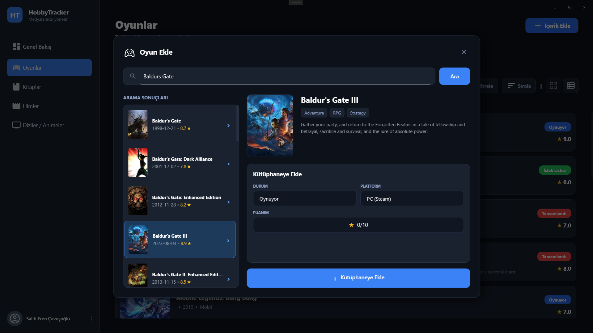
*Şekil 8: Oyun Ekleme Sayfası*

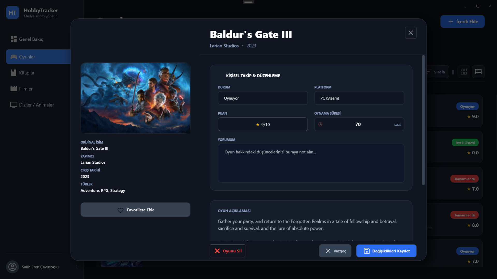
*Şekil 9: Oyun Detay Sayfası*

#### Filmler Modülü


*Şekil 10: Filmler Ana Sayfa*

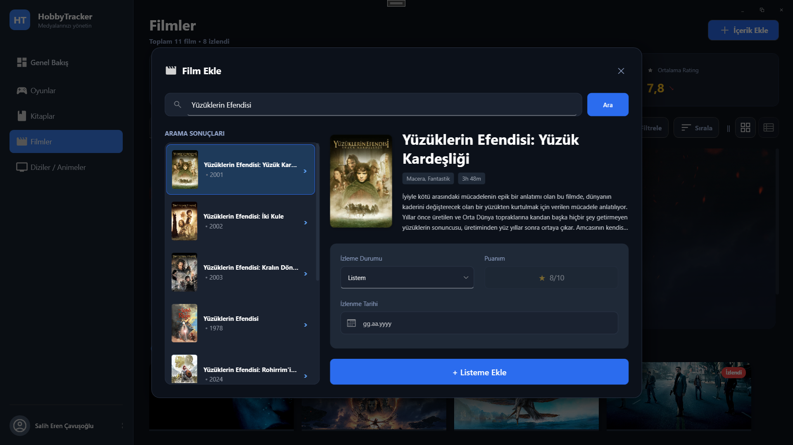
*Şekil 11: Film Ekleme Sayfası*

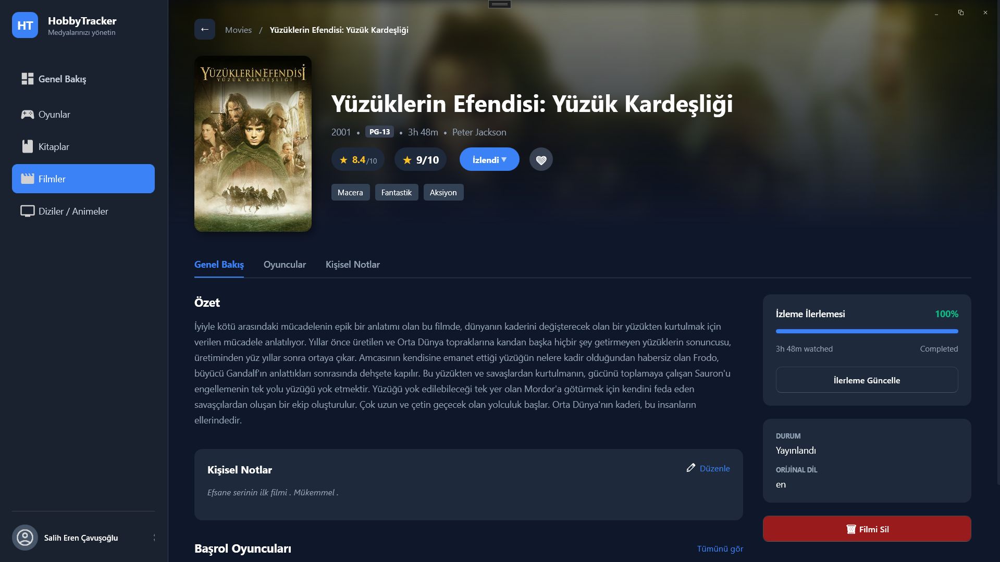
*Şekil 12: Film Detay Sayfası*

#### Kitaplar Modülü

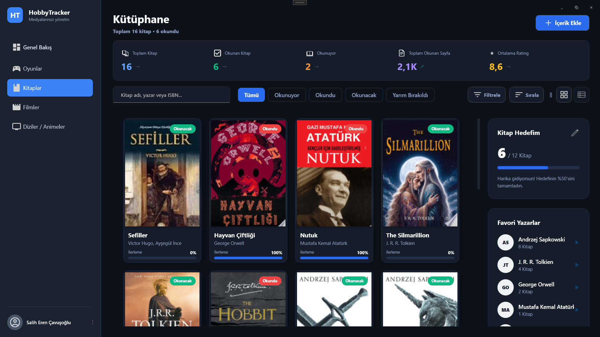
*Şekil 13: Kitaplar Ana Sayfa*

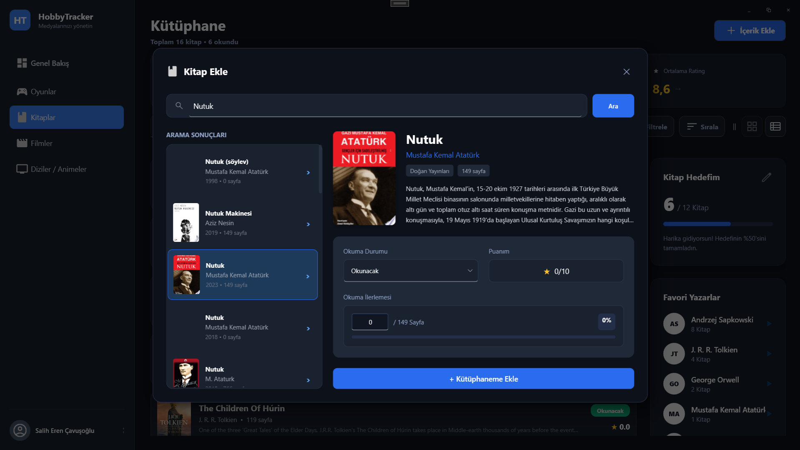
*Şekil 14: Kitap Ekleme Sayfası*


*Şekil 15: Kitap Detay Sayfası*

#### Diziler Modülü

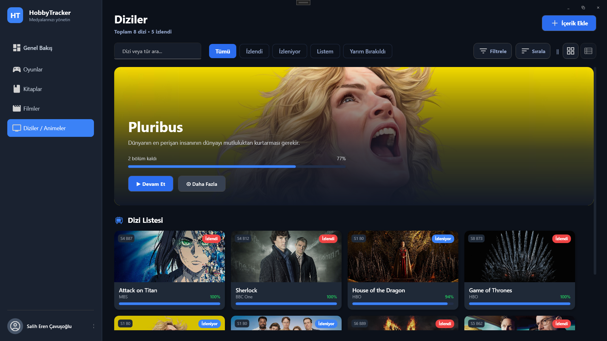
*Şekil 16: Diziler Ana Sayfa*

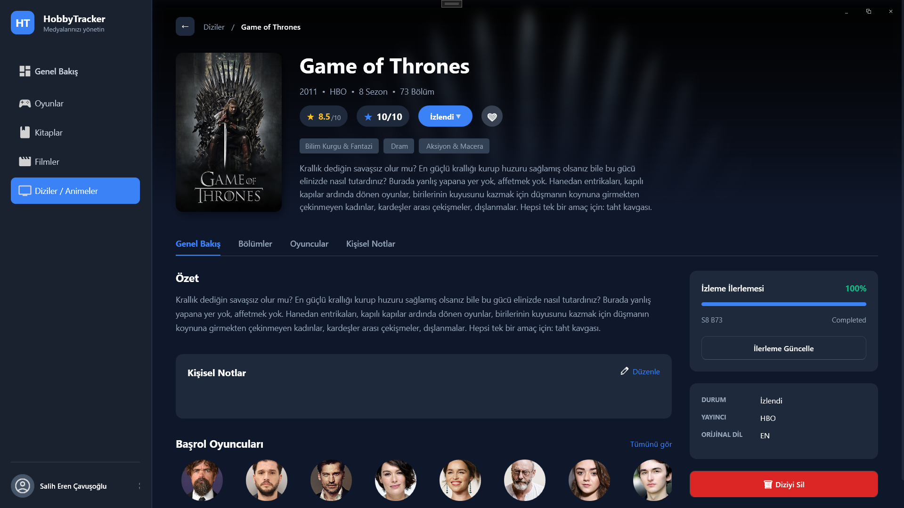
*Şekil 17: Dizi Detay Sayfası*

#### 4.1.4.2 Veri Arabirimleri
- Firebase Realtime Database: JSON formatında veri saklama
- REST API'ler: TMDB, RAWG, Google Books

#### 4.1.4.3 Diğer Sistemlerle Arabirimler
- Firebase Authentication: OAuth tabanlı kullanıcı yönetimi
- Harici Media API'leri: İçerik meta verileri

### 4.1.5 Veri Modeli
Firebase Realtime Database hiyerarşik JSON yapısı:
```
users/
  └── {userId}/
      ├── books/
      ├── movies/
      ├── games/
      ├── series/
      └── bookGoal/
```

### 4.1.6 Testler
Manuel test senaryoları ile CRUD işlemleri doğrulanmıştır.

### 4.1.7 Performans
- Lazy loading ile büyük listelerde performans optimizasyonu
- Image caching ile resim yükleme hızlandırması

## 4.2 Veri Tasarımı

### 4.2.1 Düğüm (Node) Tanımları

**Books Düğümü (Node):**
| Alan | Tip | Açıklama |
|------|-----|----------|
| Id | string | Benzersiz ID |
| Title | string | Kitap adı |
| Authors | string | Yazarlar |
| PageCount | int | Toplam sayfa |
| CurrentPage | int | Okunan sayfa |
| Status | string | Okuma durumu |

**Games Düğümü (Node):**
| Alan | Tip | Açıklama |
|------|-----|----------|
| Id | string | Benzersiz ID |
| Title | string | Oyun adı |
| Developer | string | Geliştirici |
| Platform | string | Platform |
| PlayTime | int | Oynama süresi |
| Status | string | Oynama durumu |

### 4.2.2 Düğüm-İlişki Şemaları
NoSQL yapıda ilişkiler denormalize edilmiştir. Series-Episode ilişkisi iç içe (nested) olarak saklanmaktadır.

### 4.2.3 Veri Tanımları
Tüm tarihler UTC formatında DateTime olarak saklanmaktadır.

### 4.2.4 Değer Kümesi Tanımları
- WatchStatus: PlanToWatch, InProgress, Completed, Dropped
- ReleaseStatus: Released, Upcoming, InProduction, Rumored

## 4.3 Süreç Tasarımı

### 4.3.1 Genel Tasarım
Event-driven WPF uygulama yapısı.

### 4.3.2 Modüller

#### 4.3.2.1 Kitaplar Modülü
- **İşlev:** Kitap koleksiyonu yönetimi
- **Kullanıcı Arabirimi:** BooksView.xaml, AddBookWindow.xaml, EditBookWindow.xaml (Şekil 13-15)
- **Modül Tanımı:** Google Books API entegrasyonu, sayfa takibi
- **Modül İç Tasarımı:** GoogleBooksService ile API iletişimi

#### 4.3.2.2 Filmler Modülü
- **İşlev:** Film koleksiyonu yönetimi
- **Kullanıcı Arabirimi:** MoviesView.xaml, AddMovieWindow.xaml, EditMovieWindow.xaml (Şekil 10-12)
- **Modül Tanımı:** TMDB API entegrasyonu
- **Modül İç Tasarımı:** TmdbService ile API iletişimi

#### 4.3.2.3 Oyunlar Modülü
- **İşlev:** Oyun koleksiyonu yönetimi
- **Kullanıcı Arabirimi:** GamesView.xaml, AddGameWindow.xaml, EditGameWindow.xaml (Şekil 7-9)
- **Modül Tanımı:** RAWG API entegrasyonu
- **Modül İç Tasarımı:** RAWGService ile API iletişimi

#### 4.3.2.4 Diziler Modülü
- **İşlev:** Dizi koleksiyonu ve bölüm takibi
- **Kullanıcı Arabirimi:** SeriesView.xaml, AddSeriesWindow.xaml, EditSeriesWindow.xaml (Şekil 16-17)
- **Modül Tanımı:** TMDB API entegrasyonu, sezon/bölüm takibi
- **Modül İç Tasarımı:** HashSet ile izlenen bölüm takibi

### 4.3.3 Kullanıcı Profilleri
Tek kullanıcı tipi: Bireysel kullanıcı (tüm CRUD yetkilerine sahip).

### 4.3.4 Entegrasyon ve Test Gereksinimleri
Firebase ve harici API'ler ile entegrasyon testleri yapılmıştır.

## 4.4 Ortak Alt Sistemlerin Tasarımı

### 4.4.1 Ortak Alt Sistemler
- SFirebase: Merkezi veritabanı servisi
- ImageCacheService: Resim önbellekleme
- StatsTrendService: İstatistik hesaplama

### 4.4.2 Modüller Arası Ortak Veriler
UserSession ile oturum bilgisi tüm modüllerde paylaşılmaktadır.

### 4.4.3 Ortak Veriler İçin Veri Giriş ve Raporlama Modülleri
Dashboard modülü tüm verilerden istatistik üretmektedir.

### 4.4.4 Güvenlik Altsistemi
Firebase Authentication ile e-posta/şifre tabanlı kimlik doğrulama. Kullanıcı giriş ve kayıt işlemleri Şekil 1 ve Şekil 2'de görülen arayüzler üzerinden gerçekleştirilir.

### 4.4.5 Veri Dağıtım Altsistemi
Firebase Realtime Database ile anlık senkronizasyon.

### 4.4.6 Yedekleme ve Arşivleme İşlemleri
Firebase otomatik yedekleme özellikleri kullanılmaktadır.

---

<div style="page-break-after: always;"></div>

# 5. SİSTEM GERÇEKLEŞTİRİMİ

## 5.1 Giriş
Bu bölümde HobbyTracker uygulamasının teknik gerçekleştirimi açıklanmaktadır.

## 5.2 Yazılım Geliştirme Ortamları

### 5.2.1 Programlama Dilleri
- **C# 12.0:** Ana uygulama mantığı
- **XAML:** UI tanımlamaları

### 5.2.2 Veri Tabanı Yönetim Sistemleri
Firebase Realtime Database - NoSQL, JSON tabanlı bulut veritabanı.

#### 5.2.2.1 VTYS Kullanımının Ek Yararları
- Gerçek zamanlı senkronizasyon
- Otomatik ölçeklendirme
- Sunucu yönetimi gerektirmez

#### 5.2.2.2 Veri Modelleri
Doküman tabanlı (Document-oriented) NoSQL model.

#### 5.2.2.3 Şemalar
Şema-bağımsız (Schema-less) yapı, JSON formatında.

#### 5.2.2.4 VTYS Mimarisi
Client-Server mimarisi, Firebase SDK aracılığıyla iletişim.

#### 5.2.2.5 Veritabanı Dilleri ve Arabirimleri
Firebase Realtime Database Query API kullanılmaktadır.

#### 5.2.2.6 Veri Tabanı Sistem Ortamı
Google Cloud Platform üzerinde barındırılmaktadır.

#### 5.2.2.7 VTYS'nin Sınıflandırılması
NoSQL, Realtime, Cloud-based.

#### 5.2.2.8 Hazır Program Kütüphane Dosyaları
FirebaseDatabase.net NuGet paketi kullanılmaktadır.

#### 5.2.2.9 CASE Araç ve Ortamları
Visual Studio 2022 IDE.

## 5.3 Kodlama Stili

### 5.3.1 Açıklama Satırları
XML Documentation Comments kullanılmaktadır:
```csharp
/// <summary>
/// Kitap modeli. Google Books API'den gelen veriler.
/// </summary>
```

### 5.3.2 Kod Biçimlemesi
- 4 boşluk girinti
- K&R brace stili
- Bir satırda maksimum 120 karakter

### 5.3.3 Anlamlı İsimlendirme
- PascalCase: Sınıflar, metotlar, özellikler
- camelCase: Yerel değişkenler, parametreler
- _camelCase: Private alanlar

### 5.3.4 Yapısal Programlama Yapıları
MVVM pattern, async/await pattern, INotifyPropertyChanged.

## 5.4 Program Karmaşıklığı

### 5.4.1 Programın Çizge Biçimine Dönüştürülmesi
Her modül bağımsız CRUD operasyonları içermektedir.

### 5.4.2 McCabe Karmaşıklık Ölçütü Hesaplama
Ortalama Cyclomatic Complexity: ~5-8 (kabul edilebilir seviye).

## 5.5 Olağan Dışı Durum Çözümleme

### 5.5.1 Olağandışı Durum Tanımları
- Ağ bağlantısı kesintisi
- API yanıt hataları
- Firebase kimlik doğrulama hataları

### 5.5.2 Farklı Olağandışı Durum Çözümleme Yaklaşımları
try-catch blokları ve kullanıcı dostu hata mesajları.

### 5.5.3 Vaka Analizi: Firebase Array Hatası

**Problem:** 
Dizilerde izlenen bölümleri takip etmek için başlangıçta `List<string>` (Array) yapısı kullanıldı. Ancak Firebase Realtime Database, Array'lerde aynı index'e yazma durumunda veri kaybına neden oluyordu.

**Belirti:**
- Aynı anda birden fazla bölüm işaretlendiğinde bazı veriler kayboluyordu
- "Index out of bounds" benzeri hatalar alınıyordu

**Çözüm:**
Array yapısından vazgeçilerek, HashSet mantığıyla benzersiz Key'ler kullanılan Dictionary yapısına geçildi:

```csharp
// Eski (Problemli)
public List<string> WatchedEpisodes { get; set; }

// Yeni (Çözüm)
public HashSet<string> WatchedEpisodes { get; set; }
// Firebase'de: "s1e1": true, "s1e2": true şeklinde saklanır
```

**Sonuç:**
O(1) performans ile bölüm kontrolü, veri kaybı sorunu tamamen çözüldü.

## 5.6 Kod Gözden Geçirme

### 5.6.1 Gözden Geçirme Sürecinin Düzenlenmesi
Self-review ve iteratif geliştirme.

### 5.6.2 Gözden Geçirme Sırasında Kullanılacak Sorular

#### 5.6.2.1 Öbek Arayüzü
Modüller arası bağımlılıklar minimize edilmiştir.

#### 5.6.2.2 Giriş Açıklamaları
Tüm public üyeler XML Documentation ile belgelenmiştir.

#### 5.6.2.3 Veri Kullanımı
Null-safety (.NET nullable reference types) aktiftir.

#### 5.6.2.4 Öbeğin Düzenlenişi
Logical grouping ile dosya organizasyonu.

#### 5.6.2.5 Sunuş
Temiz, okunabilir kod standardı.

---

<div style="page-break-after: always;"></div>

# 6. DOĞRULAMA VE GEÇERLEME

## 6.1 Giriş
Bu bölümde yazılımın test ve doğrulama süreçleri açıklanmaktadır.

## 6.2 Sınama Kavramları
- **Doğrulama (Verification):** Ürünü doğru inşa ettik mi?
- **Geçerleme (Validation):** Doğru ürünü mü inşa ettik?

## 6.3 Doğrulama ve Geçerleme Yaşam Döngüsü
Her sprint sonunda fonksiyonel testler uygulanmıştır.

## 6.4 Sınama Yöntemleri

### 6.4.1 Beyaz Kutu Sınaması
Kod seviyesinde mantık kontrolü yapılmıştır.

### 6.4.2 Temel Yollar Sınaması
CRUD işlemleri için temel senaryolar test edilmiştir.

## 6.5 Sınama ve Bütünleştirme Stratejileri

### 6.5.1 Yukarıdan Aşağı Sınama ve Bütünleştirme
UI'dan başlayarak servis katmanına doğru test.

### 6.5.2 Aşağıdan Yukarıya Sınama ve Bütünleştirme
Model sınıflarından başlayarak UI'a doğru test.

## 6.6 Sınama Planlaması
Her modül tamamlandığında ilgili test senaryoları çalıştırılmıştır.

## 6.7 Sınama Belirtimleri

### Pozitif Test Senaryoları
| Test Senaryosu | Beklenen Sonuç | Durum |
|----------------|----------------|-------|
| Kullanıcı kaydı | Başarılı kayıt | ✓ |
| Kullanıcı girişi | Dashboard açılır | ✓ |
| Oyun ekleme | Listeye eklenir | ✓ |
| Film düzenleme | Değişiklik kaydedilir | ✓ |
| Kitap silme | Listeden kaldırılır | ✓ |
| Dizi bölümü işaretleme | Bölüm izlendi kaydedilir | ✓ |
| API'den içerik arama | Sonuçlar listelenir | ✓ |

### Negatif Test Senaryoları (Hata Durumları)
| Test Senaryosu | Beklenen Sonuç | Durum |
|----------------|----------------|-------|
| İnternet yokken veri ekleme | Hata mesajı gösterilir | ✓ |
| Yanlış şifre ile giriş | "Hatalı giriş" uyarısı | ✓ |
| Geçersiz e-posta formatı | Validasyon hatası | ✓ |
| API rate limit aşımı | Bekleme uyarısı gösterilir | ✓ |
| Boş başlık ile kayıt | Zorunlu alan uyarısı | ✓ |

## 6.8 Yaşam Döngüsü Boyunca Sınama Etkinlikleri
Sürekli manuel test ve kullanıcı geri bildirimi.

---

<div style="page-break-after: always;"></div>

# 7. BAKIM

## 7.1 Giriş
Bu bölümde yazılımın kurulum, destek ve bakım süreçleri açıklanmaktadır.

## 7.2 Kurulum

### Sistem Gereksinimleri
| Bileşen | Gereksinim |
|---------|------------|
| İşletim Sistemi | Windows 10 (1903+) veya Windows 11 |
| Yazılım Altyapısı | .NET 8.0 Desktop Runtime |
| RAM | Minimum 4 GB |
| Disk | 200 MB boş alan |
| Ekran | 1366x768 minimum çözünürlük |
| Ağ | Aktif internet bağlantısı (zorunlu) |

### Kurulum Yöntemi
Uygulama ClickOnce veya .msi kurulum paketi ile dağıtılmaktadır.

**Self-Contained Dağıtım:** Alternatif olarak, uygulama Self-Contained modda yayınlanarak .NET Runtime'ı içinde barındırabilir. Bu yöntemle kullanıcı tarafındaki kurulum zorlukları minimize edilmiş ve bağımlılık gereksinimleri ortadan kaldırılmıştır.

## 7.3 Yerinde Destek Organizasyonu

### Seviye 1: Kullanıcı Dokümantasyonu
- Kapsamlı Kullanıcı El Kitabı
- Uygulama içi yardım menüsü
- Hedef: Sorunların %80'ini çözme

### Seviye 2: Geliştirici Desteği
- GitHub Issues üzerinden hata bildirimi
- Agile metodolojiye uygun önceliklendirme
- Patch/Update ile sorun giderme

## 7.4 Yazılım Bakımı

### 7.4.1 Tanım
Yazılım bakımı, uygulamanın yayınlanmasından sonra yapılan tüm değişiklik ve düzeltmeleri kapsar.

### 7.4.2 Bakım Süreç Modeli
| Bakım Türü | Açıklama |
|------------|----------|
| Düzeltici | Bug fix'ler |
| Uyarlayıcı | Yeni API versiyonlarına uyum |
| Mükemmelleştirici | Performans iyileştirmeleri |
| Önleyici | Kod refactoring |

---

<div style="page-break-after: always;"></div>

# 8. SONUÇ

HobbyTracker projesi, 24 günlük yoğun bir geliştirme süreci sonunda başarıyla tamamlanmıştır. Proje kapsamında:

**Başarılar:**
- 4 ana modül (Kitaplar, Filmler, Oyunlar, Diziler) geliştirildi
- Firebase entegrasyonu ile bulut tabanlı veri yönetimi sağlandı
- 3 farklı harici API (TMDB, RAWG, Google Books) başarıyla entegre edildi
- Modern Dark Theme arayüz tasarımı uygulandı
- Agile metodoloji ile esnek geliştirme süreci yönetildi

**Öğrenilen Dersler:**
- Firebase Array yapısının sınırlamaları keşfedildi ve HashSet çözümü geliştirildi
- Iteratif tasarım yaklaşımı ile kullanıcı deneyimi iyileştirildi

**Gelecek Planları:**
- Çevrimdışı mod desteği
- Mobil uygulama (MAUI)
- Sosyal özellikler (paylaşım, takip)

---

<div style="page-break-after: always;"></div>

# 9. KAYNAKLAR

1. **Microsoft .NET Documentation** - https://docs.microsoft.com/en-us/dotnet/
2. **WPF Documentation** - https://docs.microsoft.com/en-us/dotnet/desktop/wpf/
3. **Firebase Documentation** - https://firebase.google.com/docs
4. **TMDB API Documentation** - https://developers.themoviedb.org/3
5. **RAWG API Documentation** - https://rawg.io/apidocs
6. **Google Books API** - https://developers.google.com/books
7. **DevExpress WPF Controls** - https://docs.devexpress.com/WPF/
8. **CommunityToolkit.Mvvm** - https://docs.microsoft.com/en-us/dotnet/communitytoolkit/mvvm/

---

*Bu dokümantasyon HobbyTracker projesi için 4 Ocak 2026 tarihinde hazırlanmıştır.*
