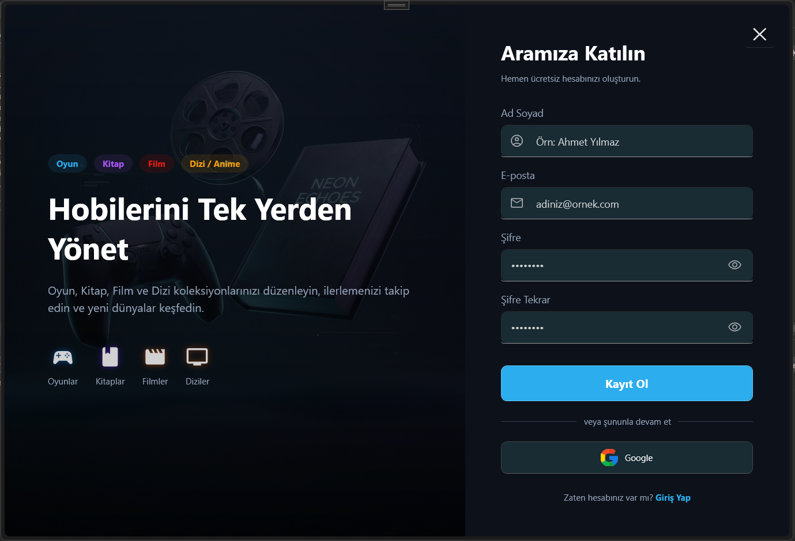
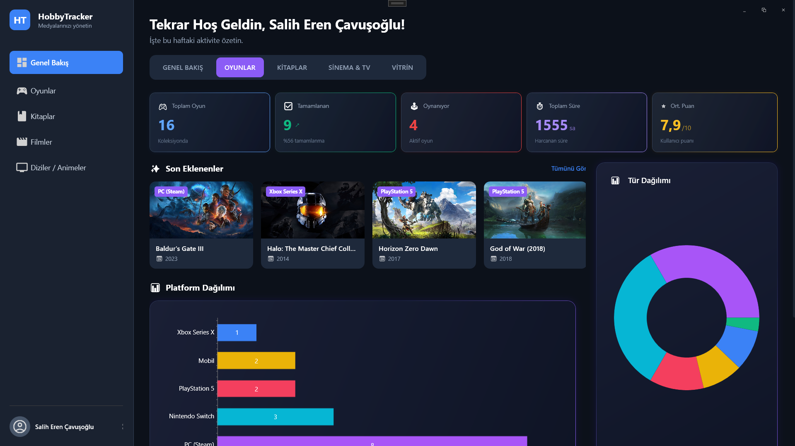
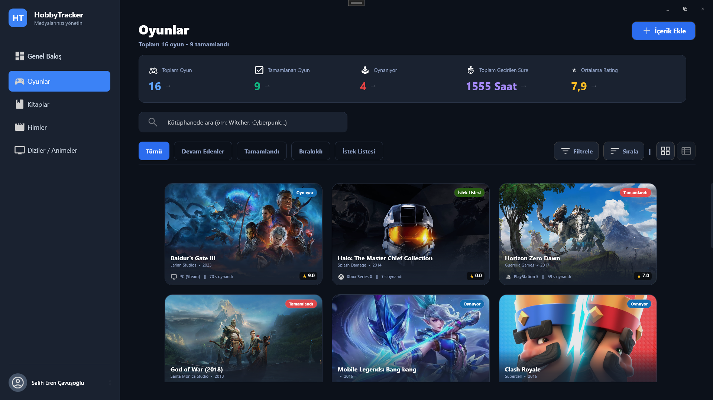
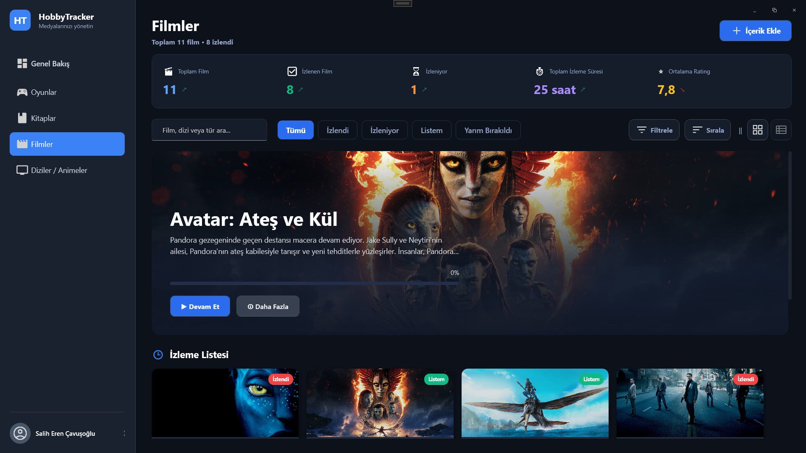
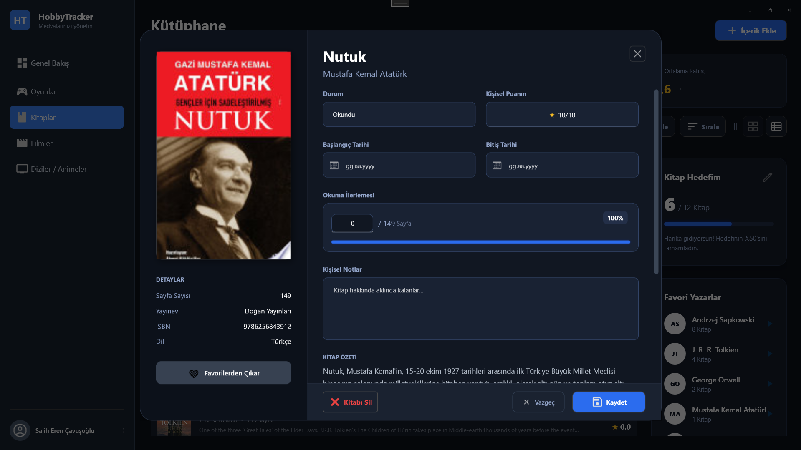

# Hobby Tracker 🎮 📚 🎬 🍿

Hobby Tracker, kullanıcıların oynadıkları oyunları, okudukları kitapları, izledikleri filmleri ve dizileri tek bir merkezden, modern bir arayüzle takip etmelerini sağlayan WPF tabanlı bir masaüstü uygulamasıdır. 

Şık, karanlık temalı (dark mode) tasarımı, akıcı animasyonları ve detaylı istatistik panelleriyle hobilerinizi arşivlemenin en keyifli yolunu sunar.


*(Daha fazla detay için [HobbyTracker Proje Dokümantasyonu](HobbyTracker_Proje_Dokumantasyonu.md) dosyasını inceleyebilirsiniz.)*

## 📸 Ekran Görüntüleri

| Genel Bakış (Oyunlar) | Oyunlar (Sekme) |
|---|---|
|  |  |

| Filmler (Sekme) | Kitaplar (Detay) |
|---|---|
|  |  |

## ✨ Özellikler

*   **Oyun Takibi**: RAWG API entegrasyonu ile binlerce oyun arasından arama yapın, durumlarını (Tamamlandı, Oynuyor, Planlandı vs.) ve puanlarınızı kaydedin.
*   **Kitap Takibi**: Okuma hedefleri belirleyin, kaldığınız sayfayı kaydederek ilerlemenizi yüzdesel olarak görün.
*   **Film ve Dizi Takibi**: The Movie Database (TMDB) API entegrasyonu ile film, dizi veya oyuncu aratarak izleme listelerinizi zenginleştirin. Sezon ve bölüm takibi yapın.
*   **Kişisel İstatistikler**: Ana ekrandaki Dashboard sayesinde son eklediğiniz içerikleri, oynama sürelerinizi, izlediğiniz toplam süreleri ve okuma ilerlemelerinizi tek ekranda analiz edin.
*   **Güvenli Bulut Kaydı**: Firebase entegrasyonu (Email/Password Authentication & Realtime Database) sayesinde verileriniz her cihazdan güvenle erişilebilir.

## 🛠 Kullanılan Teknolojiler

*   **Dil ve Platform**: C# - WPF (.NET Core/5+)
*   **Arayüz & Tasarım**: Material Design In XAML, LiveCharts (Grafikler), Custom WPF Animations.
*   **Veritabanı & Kimlik Doğrulama**: Firebase Authentication, Firebase Realtime Database
*   **Harici API'ler**: 
    *   [TMDB API](https://www.themoviedb.org/documentation/api) (Film ve Diziler)
    *   [RAWG API](https://rawg.io/apidocs) (Oyunlar)
*   **Paketler**: `Newtonsoft.Json`, `RestSharp`, `FirebaseAuthentication.net`, `FirebaseDatabase.net`

## 🚀 Kurulum ve Kullanım (Son Kullanıcılar İçin)

Projenin derlenmiş bir `Setup.exe` sürümü mevcut olsa da, **uygulamanın çalışabilmesi için harici API servislerine (TMDB, RAWG, Firebase) bağlanması gerekmektedir.**

Güvenlik sebebiyle bu API anahtarları kurulum dosyasına dahil edilmemiştir. Uygulamayı kurduktan sonra kullanabilmek için, programın kurulu olduğu dizine giderek (örn: `C:\Program Files\HobbyTracker`) bir **`secrets.json`** dosyası oluşturmanız ve içerisine kendi API anahtarlarınızı girmeniz gerekmektedir (Aşağıdaki Geliştiriciler İçin bölümündeki JSON formatına bakınız). Aksi takdirde uygulama verileri çekemeyecektir.

---

## 💻 Kurulum (Geliştiriciler İçin)

Projeyi kendi bilgisayarınızda derleyip çalıştırmak için aşağıdaki adımları izleyin:

### 1- Depoyu Klonlayın
```bash
git clone https://github.com/KULLANICI_ADINIZ/HobbyTracker.git
cd HobbyTracker
```

### 2- API Anahtarlarını Ayarlama
Uygulamanın çalışabilmesi için gerekli API servislerine (Firebase, TMDB, RAWG) ait anahtarlar güvenlik sebebiyle GitHub deposunda **bulunmamaktadır**. 

Kendi anahtarlarınızı kullanarak uygulamayı derlemek için projenin kök dizininde (`HobbyTracker/HobbyTracker/` klasöründe) bir **`secrets.json`** dosyası oluşturun ve içeriğini kendi anahtarlarınız ile doldurun:

```json
{
  "TmdbApiKey": "SİZİN_TMDB_API_ANAHTARINIZ",
  "FirebaseApiKey": "SİZİN_FIREBASE_API_ANAHTARINIZ",
  "RawgApiKey": "SİZİN_RAWG_API_ANAHTARINIZ"
}
```

> **Not:** Firebase kullanabilmek için kendi Firebase projenizi oluşturmalı ve `firebase_config.json` dosyanızı da gerekiyorsa yapılandırmanıza eklemelisiniz. Uygulamanın veritabanı adresi (`BaseUrl`) `SFirebase.cs` dosyasından projenize uygun şekilde değiştirilmelidir.

### 3- Projeyi Derleyin ve Çalıştırın
Visual Studio'yu açıp `HobbyTracker.sln` çözüm dosyasını yükleyin, NuGet paketlerini geri yükleyin (Restore NuGet Packages) ve uygulamayı başlatın (F5).

---

## 📝 Lisans ve İletişim

Bu proje kişisel bir hobi geliştirme projesi olup, açık kaynaklı geliştirilmektedir. Daha detaylı teknik belgeler için projede bulunan `HobbyTracker_Proje_Dokumantasyonu.md` (veya .pdf) dosyasını inceleyebilirsiniz.
